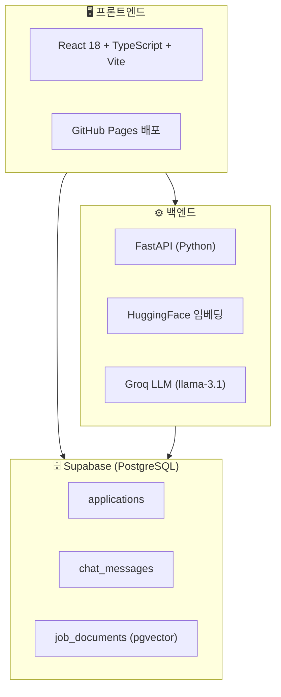

# 취업 지원 현황 트래커

> 여러 채용 플랫폼에 지원한 내역을 한 곳에서 관리하고, AI로 면접을 준비하는 개인용 대시보드

**배포 URL**: https://jjjuni-0818.github.io/job-tracker/

---

## 만든 이유

원티드, 사람인, 그룹바이를 동시에 쓰다 보니 지원한 곳이 50개가 넘어갔다.
어디에 넣었는지, 지금 상태가 뭔지 한눈에 안 보였다.
필요해서 직접 만들었다.

---

## 주요 기능

| 기능 | 설명 |
|------|------|
| 지원 내역 관리 | 회사명, 포지션, 플랫폼, 지원일, 상태, 공고URL, 면접날짜, 메모 |
| 상태 관리 | 서류중 / 서류합격 / 면접 / 최종합격 / 탈락 |
| 플랫폼별 탭 | 원티드 / 사람인 / 그룹바이 등 플랫폼 분리 |
| 상태별 필터 | 상태 카드 클릭으로 필터링 |
| 수정 / 삭제 | 각 항목 인라인 수정 및 삭제 |
| AI 면접 준비 | 공고 URL 입력 → RAG 기반 채팅으로 면접 준비 |
| 채팅 기록 저장 | 모달 닫아도 이전 대화 유지 |

---

## 기술 스택



| 역할 | 기술 |
|------|------|
| 프론트엔드 | React 18 + TypeScript + Vite |
| DB | Supabase (PostgreSQL + pgvector) |
| 백엔드 | FastAPI (Python) |
| 임베딩 | HuggingFace sentence-transformers |
| LLM | Groq API (llama-3.1-8b-instant) |
| 배포 | GitHub Pages + GitHub Actions |

**전부 무료 스택입니다.**

---

## 로컬 실행

### 사전 준비

- Node.js 18+
- Python 3.10+
- Supabase 프로젝트

### 1. 클론 및 설치

```bash
git clone https://github.com/jjjuni-0818/job-tracker.git
cd job-tracker
npm install
```

### 2. 환경변수 설정

```bash
# 프론트엔드
cp .env.example .env
```

`.env` 파일에 Supabase 정보 입력:
```env
VITE_SUPABASE_URL=https://your-project.supabase.co
VITE_SUPABASE_ANON_KEY=eyJ...
```

```bash
# 백엔드
cd backend
cp .env.example .env  # 없으면 직접 생성
```

`backend/.env` 파일에 입력:
```env
SUPABASE_URL=https://your-project.supabase.co
SUPABASE_KEY=eyJ...   # service_role key
GROQ_API_KEY=gsk_...
```

### 3. 백엔드 의존성 설치

```bash
cd backend
python3 -m venv venv
source venv/bin/activate
pip install -r requirements.txt
```

### 4. Supabase 테이블 생성

Supabase SQL Editor에서 실행:

```sql
-- 지원 목록
create table applications (
  id           uuid        primary key default gen_random_uuid(),
  company_name text        not null,
  position     text        not null,
  platform     text        not null default '원티드',
  applied_at   date        not null,
  status       text        not null default '서류중',
  job_url      text        default '',
  interview_at date,
  notes        text        default '',
  created_at   timestamptz default now()
);
alter table applications disable row level security;

-- 채팅 기록
create table chat_messages (
  id             uuid        primary key default gen_random_uuid(),
  application_id uuid        references applications(id) on delete cascade,
  role           text        not null,
  content        text        not null,
  created_at     timestamptz default now()
);
alter table chat_messages disable row level security;

-- 공고 벡터 (RAG)
create extension if not exists vector;
create table job_documents (
  id             uuid        primary key default gen_random_uuid(),
  application_id uuid        references applications(id) on delete cascade,
  content        text        not null,
  embedding      vector(384),
  created_at     timestamptz default now()
);
alter table job_documents disable row level security;
```

### 5. 실행

```bash
# 한번에 실행 (권장)
cd ~/job-tracker
./start.sh

# 또는 터미널 2개로 따로 실행
# 터미널 1 — 백엔드
cd backend && source venv/bin/activate && uvicorn main:app --reload --port 8000

# 터미널 2 — 프론트
npm run dev
```

접속: http://localhost:5173/job-tracker/

---

## AI 면접 준비 사용법

1. 지원 항목에서 ✏️ 수정 → 공고 URL 입력 후 저장
2. 해당 항목의 💬 버튼 클릭
3. **공고 분석 시작** 버튼 클릭 (최초 1회만)
4. 질문 입력

```
"예상 면접 질문 알려줘"
"이 회사 주요 기술스택이 뭐야?"
"자격요건이 어떻게 돼?"
```

> ⚠️ AI 채팅은 백엔드 서버가 실행 중일 때만 동작합니다.
> 배포 URL(GitHub Pages)에서는 로컬 백엔드 서버를 따로 켜야 합니다.

---

## 프로젝트 구조

```
job-tracker/
├── src/
│   ├── components/
│   │   ├── AddModal.tsx      # 지원 추가
│   │   ├── EditModal.tsx     # 지원 수정
│   │   └── ChatModal.tsx     # AI 면접 준비 채팅
│   ├── lib/supabase.ts       # DB 연결
│   ├── types/index.ts        # 공통 타입
│   └── App.tsx               # 메인 페이지
├── backend/
│   ├── main.py               # FastAPI 엔드포인트
│   ├── crawler.py            # 공고 크롤링
│   ├── embedder.py           # 벡터 임베딩
│   ├── llm.py                # Groq LLM
│   ├── db.py                 # Supabase 연동
│   └── requirements.txt
├── docs/
│   ├── PRD.md                # 기획 문서
│   ├── SETUP.md              # 셋업 가이드
│   ├── DASHBOARD.md          # 화면 구조
│   ├── PROJECT_SUMMARY.md    # 전체 정리 + 머메이드
│   └── velog_post.md         # 벨로그 포스트 초안
├── start.sh                  # 한번에 실행 스크립트
└── .github/workflows/
    └── deploy.yml            # GitHub Actions 자동 배포
```

---

## 문서

- [전체 프로젝트 정리](docs/PROJECT_SUMMARY.md) — 구조, 트러블슈팅, 머메이드 다이어그램
- [PRD](docs/PRD.md) — 기획 문서
- [셋업 가이드](docs/SETUP.md) — 상세 설치 방법
- [CLAUDE.md](CLAUDE.md) — Claude Code 작업 가이드

---

## 앞으로 할 것

- [ ] Railway 백엔드 배포 (배포 URL에서도 AI 채팅 가능하게)
- [ ] 통계 차트 (월별 지원 수, 합격률)
- [ ] 모바일 반응형
- [ ] RAG 고도화 (청킹, 리랭킹)
