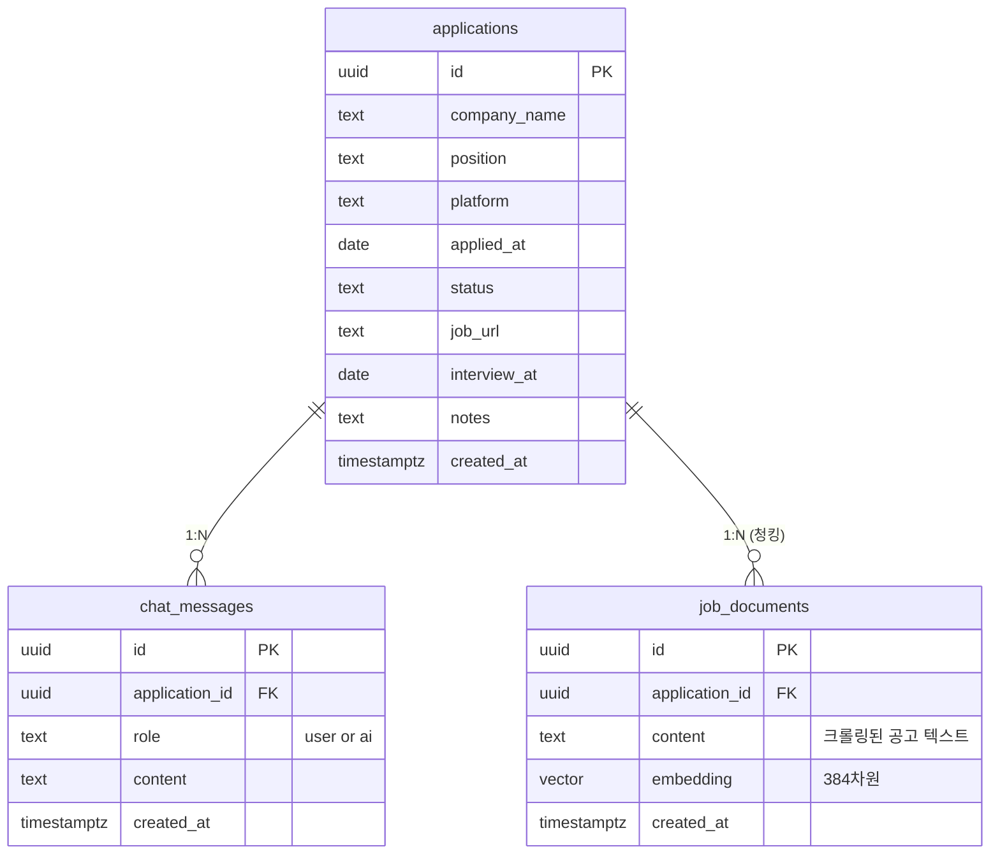
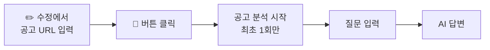

# 취업 지원 현황 트래커

> 여러 채용 플랫폼에 지원한 내역을 한 곳에서 관리하고, AI로 면접을 준비하는 개인용 대시보드

**배포 URL**: https://[username].github.io/job-tracker/

---

## 만든 이유

원티드, 사람인, 그룹바이를 동시에 쓰다 보니 어디에 지원했는지, 지금 상태가 뭔지 한눈에 안 보였다.
마침 LLM + RAG를 미니 프로젝트로 해보고 싶기도 했고, "지금 당장 나한테 필요한 게 뭐지?" 생각했을 때 바로 이게 떠올라 시작해보았다.

---

## 주요 기능

| 기능 | 설명 |
|------|------|
| 지원 내역 관리 | 회사명, 포지션, 플랫폼, 지원일, 상태, 공고URL, 면접날짜, 메모 |
| 상태 관리 | 서류중 / 서류합격 / 면접 / 최종합격 / 탈락 |
| 플랫폼별 탭 | 원티드 / 사람인 / 그룹바이 등 플랫폼 분리 |
| 상태별 필터 | 상태 카드 클릭으로 필터링 |
| 수정 / 삭제 | 각 항목 인라인 수정 및 삭제 |
| AI 면접 준비 | 공고 URL 입력 → RAG 기반 채팅으로 면접 준비 |
| 채팅 기록 저장 | 모달 닫아도 이전 대화 유지 |

---

## 기술 스택

| | 기술 |
|------|------|
| 프론트엔드 | React 18 + TypeScript + Vite |
| 백엔드 | FastAPI (Python) |
| DB | Supabase (PostgreSQL + pgvector) |
| 임베딩 | Cohere API (embed-multilingual-light-v3.0) |
| LLM | Groq API (llama-3.1-8b-instant) |
| 배포 | GitHub Pages + Railway |

전부 무료 스택으로 구성했다.

---

## DB ERD



---

## API 엔드포인트

### Supabase REST API (자동 생성)

| 메서드 | 경로 | 역할 |
|--------|------|------|
| GET | `/rest/v1/applications` | 지원 목록 조회 |
| POST | `/rest/v1/applications` | 지원 추가 |
| PATCH | `/rest/v1/applications?id=eq.{id}` | 지원 수정 |
| DELETE | `/rest/v1/applications?id=eq.{id}` | 지원 삭제 |
| GET | `/rest/v1/chat_messages` | 채팅 기록 조회 |
| POST | `/rest/v1/chat_messages` | 채팅 메시지 저장 |

### FastAPI 백엔드 (직접 구현)

| 메서드 | 경로 | 역할 | 요청 바디 |
|--------|------|------|-----------|
| GET | `/health` | 서버 상태 확인 | - |
| POST | `/ingest` | 공고 크롤링 + 벡터 저장 | `{application_id, url, company_name, position}` |
| POST | `/chat` | RAG 채팅 답변 (동기) | `{application_id, question, company_name, position, status}` |
| POST | `/chat/stream` | RAG 채팅 답변 (스트리밍) | `{application_id, question, company_name, position, status}` |

---

## 로컬 실행

### 사전 준비

- Node.js 18+
- Python 3.10+
- Supabase 프로젝트

### 1. 클론 및 설치

```bash
git clone https://github.com/[username]/job-tracker.git
cd job-tracker
npm install
```

### 2. 환경변수 설정

```bash
cp .env.example .env
```

`.env` 파일에 Supabase 정보 입력:
```env
VITE_SUPABASE_URL=https://your-project.supabase.co
VITE_SUPABASE_ANON_KEY=eyJ...
```

`backend/.env` 파일:
```env
SUPABASE_URL=https://your-project.supabase.co
SUPABASE_KEY=eyJ...   # service_role key
GROQ_API_KEY=gsk_...
```

### 3. 백엔드 의존성 설치

```bash
cd backend
python3 -m venv venv
source venv/bin/activate
pip install -r requirements.txt
```

### 4. Supabase 테이블 생성

Supabase SQL Editor에서 실행:

```sql
create table applications (
  id           uuid        primary key default gen_random_uuid(),
  company_name text        not null,
  position     text        not null,
  platform     text        not null default '원티드',
  applied_at   date        not null,
  status       text        not null default '서류중',
  job_url      text        default '',
  interview_at date,
  notes        text        default '',
  created_at   timestamptz default now()
);
alter table applications disable row level security;

create table chat_messages (
  id             uuid        primary key default gen_random_uuid(),
  application_id uuid        references applications(id) on delete cascade,
  role           text        not null,
  content        text        not null,
  created_at     timestamptz default now()
);
alter table chat_messages disable row level security;

create extension if not exists vector;
create table job_documents (
  id             uuid        primary key default gen_random_uuid(),
  application_id uuid        references applications(id) on delete cascade,
  content        text        not null,
  embedding      vector(384),
  created_at     timestamptz default now()
);
alter table job_documents disable row level security;

-- 벡터 유사도 검색 함수 (RAG에 필수)
create or replace function match_job_documents(
  query_embedding vector(384),
  match_application_id uuid,
  match_count int default 5
)
returns table(content text, similarity float)
language sql
as $$
  select
    content,
    1 - (embedding <=> query_embedding) as similarity
  from job_documents
  where application_id = match_application_id
  order by embedding <=> query_embedding
  limit match_count;
$$;
```

### 5. 실행

```bash
# 한번에 실행 (권장)
./start.sh

# 또는 터미널 2개로 따로 실행
# 터미널 1 — 백엔드
cd backend && source venv/bin/activate && uvicorn main:app --reload --port 8000

# 터미널 2 — 프론트
npm run dev
```

접속: http://localhost:5173/job-tracker/

---

## AI 면접 준비 사용법



질문 예시:
```
"예상 면접 질문 알려줘"
"이 회사 주요 기술스택이 뭐야?"
"내 기술스택으로 어필할 수 있는 부분이 뭐야?"
"자기소개를 어떻게 하면 좋을까?"
```

> ⚠️ AI 채팅은 백엔드 서버가 실행 중일 때만 동작합니다.

---

## 프로젝트 구조

```
job-tracker/
├── src/
│   ├── components/
│   │   ├── AddModal.tsx      # 지원 추가
│   │   ├── EditModal.tsx     # 지원 수정
│   │   ├── ChatModal.tsx     # AI 면접 준비 채팅
│   │   ├── Login.tsx         # 비밀번호 보호 화면
│   │   └── Icons.tsx         # SVG 아이콘 모음
│   ├── lib/supabase.ts       # DB 연결
│   ├── types/index.ts        # 공통 타입 + 상수
│   └── App.tsx               # 메인 페이지
├── backend/
│   ├── main.py               # FastAPI 엔드포인트
│   ├── crawler.py            # 공고 크롤링 (BeautifulSoup)
│   ├── embedder.py           # 벡터 임베딩 (Cohere API)
│   ├── llm.py                # Groq LLM 호출
│   ├── db.py                 # Supabase 벡터 DB 연동
│   ├── requirements.txt      # Python 패키지
│   └── railway.toml          # Railway 배포 설정
├── docs/
│   ├── PRD.md
│   ├── SETUP.md
│   ├── PROJECT_SUMMARY.md
│   ├── PROJECT_SUMMARY2.md
│   ├── velog_post.md         # 벨로그 1편
│   ├── velog_rag.md          # 벨로그 2편 (RAG 1차)
│   └── velog_rag2.md         # 벨로그 3편 (RAG 고도화)
├── start.sh                  # 한번에 실행
├── CLAUDE.md                 # Claude Code 가이드
└── .github/workflows/
    └── deploy.yml            # GitHub Actions 자동 배포
```

---

## 문서

- [1차 개발 정리](docs/PROJECT_SUMMARY.md)
- [2차 개발 정리](docs/PROJECT_SUMMARY2.md) — UI/UX, RAG, 프롬프트 고도화
- [PRD](docs/PRD.md) — 기획 문서
- [CLAUDE.md](CLAUDE.md) — Claude Code 작업 가이드

---

## 앞으로 할 것

- [x] Railway 백엔드 배포 (배포 URL에서도 AI 채팅 가능하게)
- [ ] 통계 차트 (월별 지원 수, 합격률)
- [ ] 모바일 반응형
- [x] RAG 고도화 (벡터 검색, 청킹, 스트리밍)
- [ ] RAG 고도화 2단계 (리랭킹, 채팅 히스토리 컨텍스트)
