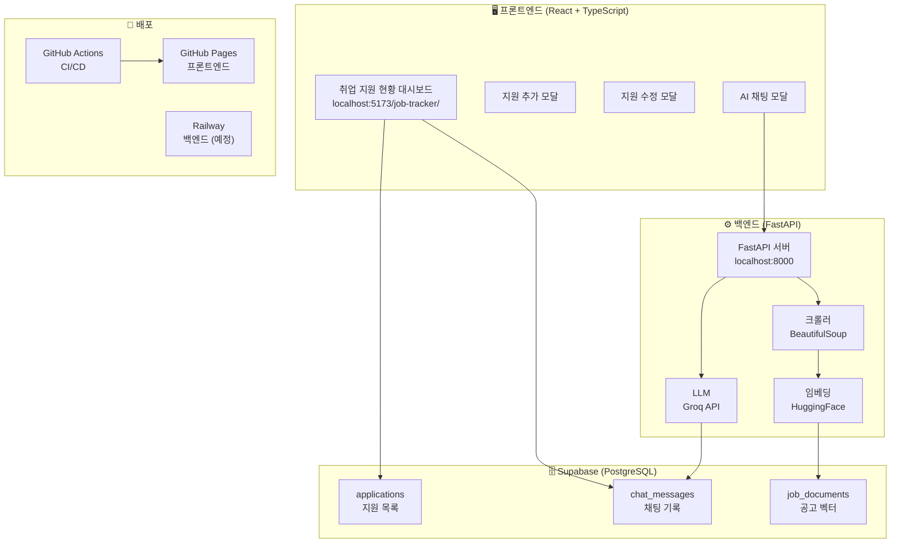
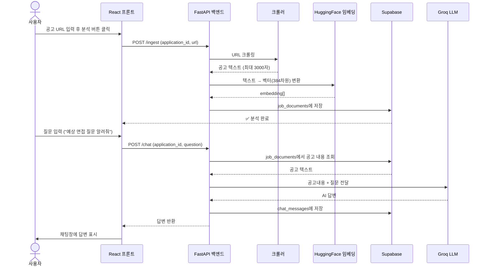
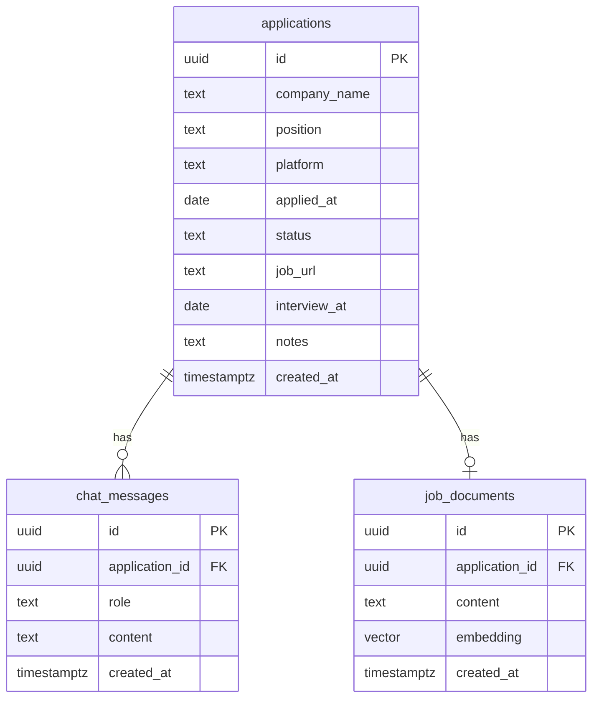
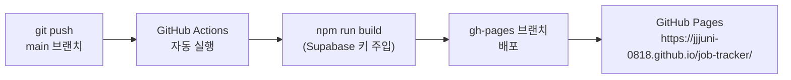
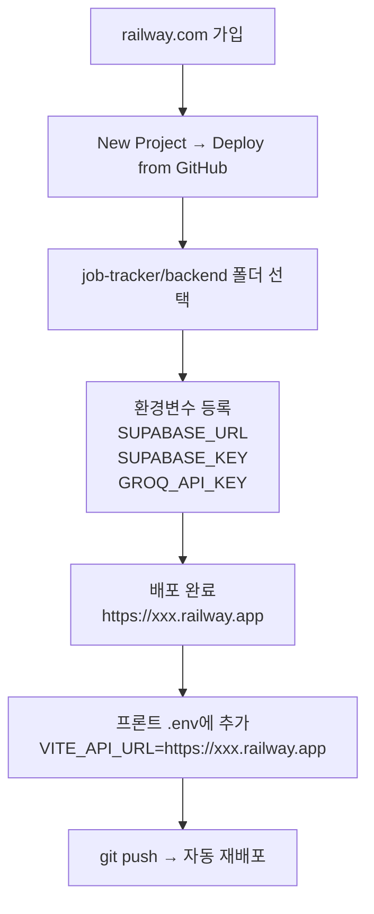

# 취업 지원 현황 트래커 — 전체 정리

작성일: 2026-06-03  
작성자: 정주원

---

## 1. 전체 구조 (Mermaid 다이어그램)

### 시스템 아키텍처



---

### RAG 동작 흐름



---

### 데이터베이스 관계



---

## 2. 기술 스택

| 역할 | 기술 | 비용 |
|------|------|------|
| 프론트엔드 | React 18 + TypeScript + Vite | 무료 |
| 데이터베이스 | Supabase (PostgreSQL) | 무료 |
| 벡터 DB | Supabase pgvector | 무료 |
| 백엔드 | FastAPI (Python) | 무료 |
| 크롤링 | BeautifulSoup | 무료 |
| 임베딩 | HuggingFace sentence-transformers | 무료 |
| LLM | Groq API (llama-3.1-8b-instant) | 무료 |
| 배포 | GitHub Pages + GitHub Actions | 무료 |
| 백엔드 배포 | Railway (예정) | 무료 플랜 |

---

## 3. Supabase 테이블 전체

```sql
-- 1. 지원 목록
create table applications (
  id           uuid        primary key default gen_random_uuid(),
  company_name text        not null,
  position     text        not null,
  platform     text        not null default '원티드',
  applied_at   date        not null,
  status       text        not null default '서류중',
  job_url      text        default '',
  interview_at date,
  notes        text        default '',
  created_at   timestamptz default now()
);
alter table applications disable row level security;

-- 2. 채팅 기록
create table chat_messages (
  id             uuid        primary key default gen_random_uuid(),
  application_id uuid        references applications(id) on delete cascade,
  role           text        not null,
  content        text        not null,
  created_at     timestamptz default now()
);
alter table chat_messages disable row level security;

-- 3. 공고 벡터 (RAG)
create extension if not exists vector;
create table job_documents (
  id             uuid        primary key default gen_random_uuid(),
  application_id uuid        references applications(id) on delete cascade,
  content        text        not null,
  embedding      vector(384),
  created_at     timestamptz default now()
);
alter table job_documents disable row level security;

-- 4. 나중에 추가한 컬럼들
alter table applications add column job_url text default '';
alter table applications add column interview_at date;
```

---

## 4. 환경변수 정리

### 프론트엔드 (`~/job-tracker/.env`)
```env
VITE_SUPABASE_URL=https://eksyliqqmvfspujizyru.supabase.co
VITE_SUPABASE_ANON_KEY=eyJ...   # Supabase anon public key
```

### 백엔드 (`~/job-tracker/backend/.env`)
```env
SUPABASE_URL=https://eksyliqqmvfspujizyru.supabase.co
SUPABASE_KEY=eyJ...             # Supabase service_role key (anon과 다름!)
GROQ_API_KEY=gsk_...            # Groq API key
```

### GitHub Secrets (배포용)
- `VITE_SUPABASE_URL`
- `VITE_SUPABASE_ANON_KEY`
- GitHub 레포 → Settings → Secrets → Actions에서 등록

### Railway 환경변수 (백엔드 배포 시)
- `SUPABASE_URL`
- `SUPABASE_KEY`
- `GROQ_API_KEY`
- `ALLOWED_ORIGINS` = `https://jjjuni-0818.github.io`

---

## 5. 로컬 실행 방법

### 한번에 실행 (권장)
```bash
cd ~/job-tracker
./start.sh
```
→ 백엔드 + 프론트 동시 실행
→ **Ctrl+C** 로 둘 다 종료

### 수동 실행 (터미널 2개)
```bash
# 터미널 1 — 백엔드
cd ~/job-tracker/backend
source venv/bin/activate
uvicorn main:app --reload --port 8000

# 터미널 2 — 프론트
cd ~/job-tracker
npm run dev
```

접속: `http://localhost:5173/job-tracker/`

---

## 6. 배포



> ⚠️ 배포 URL에서는 AI 채팅 기능이 안 됩니다.
> 백엔드(FastAPI)가 로컬에서만 실행되기 때문.
> Railway에 백엔드 배포 후 `VITE_API_URL` 환경변수 추가하면 해결됩니다.

---

## 7. Railway 백엔드 배포 방법



1. [railway.com](https://railway.com) 가입 (GitHub 로그인)
2. **New Project** → **Deploy from GitHub repo**
3. `jjjuni-0818/job-tracker` 선택 → **Root Directory**: `backend`
4. 환경변수 등록 (Variables 탭):
   - `SUPABASE_URL`
   - `SUPABASE_KEY`
   - `GROQ_API_KEY`
5. 배포 완료 후 URL 복사
6. 프론트 `ChatModal.tsx`의 `API` 상수를 Railway URL로 변경

---

## 8. 겪었던 문제와 해결 방법

### 문제 1 — 저장이 안 됨 (Supabase RLS)
- **원인**: Supabase 기본 보안 정책(RLS)이 INSERT를 막음
- **해결**:
```sql
alter table applications disable row level security;
alter table chat_messages disable row level security;
alter table job_documents disable row level security;
```

### 문제 2 — .env에 placeholder 텍스트 그대로
- **원인**: `.env.example` 복사 후 실제 값 교체 안 함
- **증상**: 브라우저 콘솔에 `your-project-id.supabase.co` 에러
- **해결**: `.env` 열어서 실제 키 교체 후 `npm run dev` 재시작

### 문제 3 — 포트 8000 이미 사용 중
- **원인**: 백그라운드 서버가 살아있는 상태에서 또 실행
- **해결**:
```bash
lsof -ti:8000 | xargs kill -9
```

### 문제 4 — Groq 모델 오류 (model_decommissioned)
- **원인**: `llama3-8b-8192` 모델 지원 종료
- **해결**: `llama-3.1-8b-instant` 으로 변경 (`backend/llm.py`)

### 문제 5 — 한글 Enter 시 마지막 글자가 남음
- **원인**: 한글 자모 조합 중 Enter 이벤트 중복 발생
- **해결**:
```tsx
onKeyDown={e => { if (e.key === 'Enter' && !e.nativeEvent.isComposing) handleSend(); }}
```

### 문제 6 — 채팅 기록이 저장 안 됨
- **원인**: `chat_messages` 테이블 RLS 활성화
- **해결**: `alter table chat_messages disable row level security;`

---

## 9. 폴더 구조

```
job-tracker/
├── CLAUDE.md                  # Claude Code 가이드
├── README.md                  # 프로젝트 소개
├── start.sh                   # 한번에 실행 스크립트
├── .env                       # 환경변수 (git 제외)
├── .env.example               # 환경변수 템플릿
├── vite.config.ts             # base: '/job-tracker/' 설정
├── docs/
│   ├── PRD.md                 # 기획 문서
│   ├── SETUP.md               # 셋업 가이드
│   ├── DASHBOARD.md           # 화면 구조 설명
│   └── PROJECT_SUMMARY.md     # 이 파일
├── .github/workflows/
│   └── deploy.yml             # GitHub Actions 자동 배포
├── src/
│   ├── types/index.ts         # 공통 타입 + 상수
│   ├── lib/supabase.ts        # Supabase 클라이언트
│   ├── components/
│   │   ├── AddModal.tsx       # 지원 추가 모달
│   │   ├── EditModal.tsx      # 지원 수정 모달
│   │   ├── ChatModal.tsx      # AI 채팅 모달 (RAG)
│   │   └── StatusBadge.tsx    # 상태 뱃지
│   └── App.tsx                # 메인 페이지
└── backend/                   # FastAPI RAG 서버
    ├── .env                   # 백엔드 환경변수 (git 제외)
    ├── requirements.txt       # Python 패키지 목록
    ├── railway.toml           # Railway 배포 설정
    ├── Procfile               # 서버 실행 명령
    ├── main.py                # FastAPI 앱 + 라우터
    ├── crawler.py             # 공고 URL 크롤링
    ├── embedder.py            # 텍스트 벡터 변환
    ├── llm.py                 # Groq LLM 호출
    ├── db.py                  # Supabase 벡터 DB 연동
    └── venv/                  # Python 가상환경 (git 제외)
```

---

## 10. 앞으로 할 것

- [ ] Railway 백엔드 배포 → 배포 URL에서도 AI 채팅 가능
- [ ] 통계 차트 (월별 지원 수, 합격률)
- [ ] 모바일 반응형
- [ ] 검색 기능
