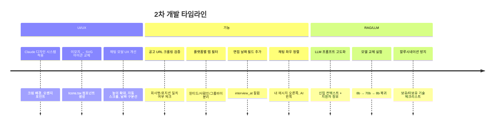
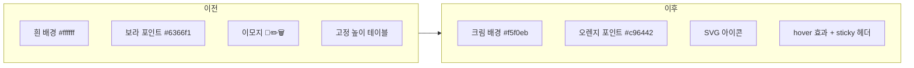
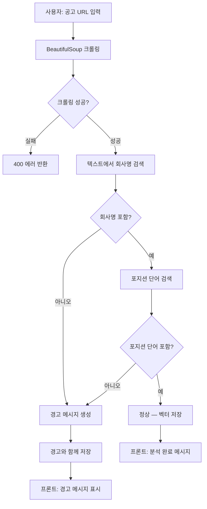
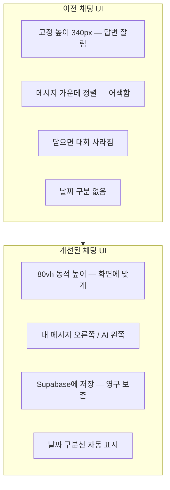
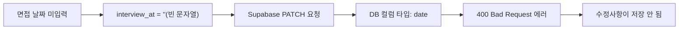
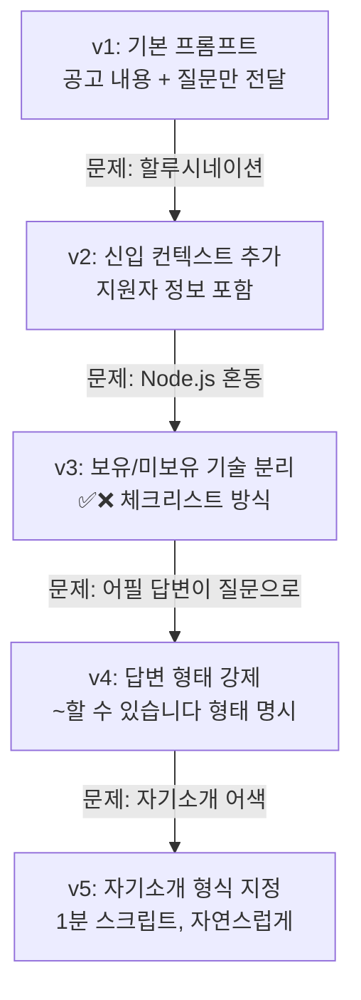
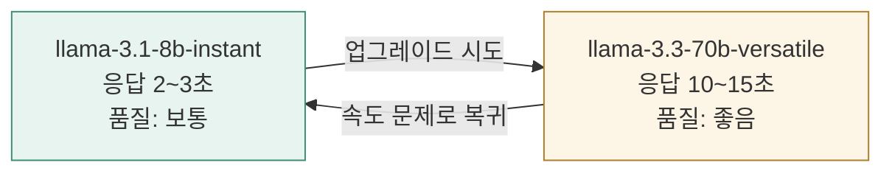
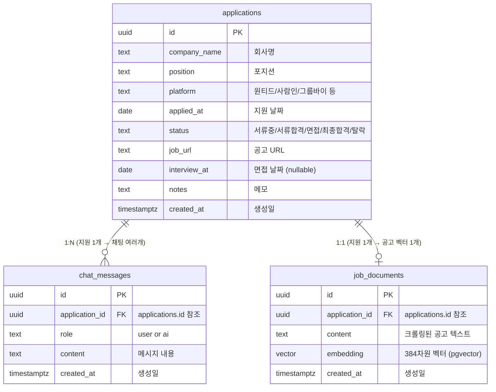
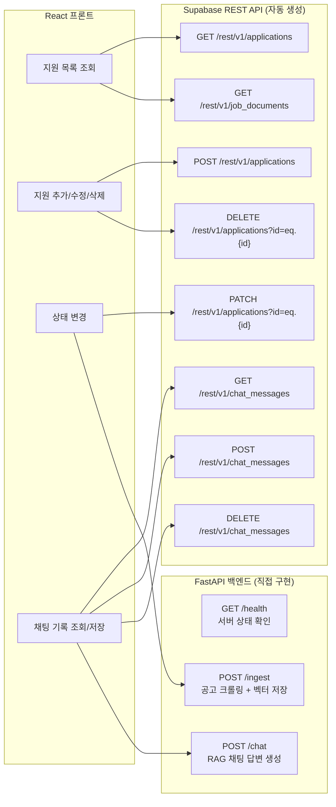

# 취업 지원 현황 트래커 — 2차 개발 정리

작성일: 2026-06-04
작성자: 정주원

> PROJECT_SUMMARY.md 이후 추가 개발 내용 정리

---

## 1. 추가 개발 전체 흐름



---

## 2. Claude 디자인 시스템 적용

### 변경 전 vs 후



### CSS 변수 시스템 (`App.css`)

```css
:root {
  --bg: #f5f0eb;           /* 따뜻한 크림 배경 */
  --surface: #faf7f4;      /* 카드 배경 */
  --surface-2: #f0ebe4;    /* 호버 배경 */
  --border: #e8e0d6;       /* 경계선 */
  --text-1: #1a1512;       /* 주 텍스트 */
  --text-2: #6b5f52;       /* 보조 텍스트 */
  --text-3: #9e9085;       /* 흐린 텍스트 */
  --accent: #c96442;       /* Claude 오렌지 */
  --purple: #7c6af7;       /* 보라 포인트 */
}
```

**왜 CSS 변수를 쓰냐?**
- 색상을 한 곳에서 관리 → 테마 변경 시 변수 하나만 바꾸면 전체 적용
- `var(--accent)` 방식으로 컴포넌트에서 참조
- 나중에 다크모드 추가 시 변수값만 바꾸면 됨

---

## 3. SVG 아이콘 시스템 (`Icons.tsx`)

### 왜 이모지 대신 SVG?

| 이모지 | SVG |
|--------|-----|
| OS/브라우저마다 다르게 보임 | 항상 동일하게 렌더링 |
| 크기 조절 어려움 | size prop으로 자유롭게 조절 |
| 색상 변경 불가 | color prop으로 동적 변경 |
| 디자인 일관성 없음 | 일관된 선 굵기/스타일 |

### 아이콘 컴포넌트 구조

```tsx
// 모든 아이콘의 공통 인터페이스
interface IconProps {
  size?: number;    // 기본값 16
  color?: string;  // 기본값 'currentColor' (부모 색상 상속)
  style?: React.CSSProperties;
}

// 사용 예시
<IconEdit size={15} color="var(--text-3)" />
<IconChat color="var(--purple)" />
```

**currentColor란?**
CSS의 특수 값으로, 부모 요소의 color를 상속받음.
별도 color를 지정하지 않으면 자동으로 주변 텍스트 색상과 맞춰짐.

---

## 4. 공고 URL 크롤링 검증

### 동작 흐름



### 검증 코드 (backend/main.py)

```python
# 회사명이 크롤링된 텍스트에 있는지 확인
text_lower = text.lower()
company_found = req.company_name.lower() in text_lower

# 포지션은 단어 단위로 하나라도 있으면 OK
# ex) "백엔드 개발자" → "백엔드", "개발자" 중 하나라도 있으면 통과
position_words = [w for w in req.position.lower().split() if len(w) > 1]
position_found = any(w in text_lower for w in position_words)
```

**왜 이렇게 했나?**
- 회사명은 정확히 매칭 (오타 있으면 경고)
- 포지션은 단어 단위 → "주니어 백엔드 개발자"를 "백엔드"로도 찾을 수 있게

---

## 5. 채팅 UX 개선

### 개선 내용



### 한글 Enter 버그 수정

```tsx
// 문제: "안녕" 입력 후 Enter → "녕"이 입력창에 남음
// 원인: 한글은 자모 조합 방식이라 Enter 이벤트가 조합 중에 중복 발생

// 해결: isComposing 체크
onKeyDown={e => {
  if (e.key === 'Enter' && !e.nativeEvent.isComposing) handleSend();
}}

// isComposing: 한글 자모를 조합 중이면 true
// 조합이 완료된 후에만 전송 실행
```

### 자동 스크롤 구현

```tsx
const bottomRef = useRef<HTMLDivElement>(null);

// 메시지가 추가될 때마다 맨 아래로 스크롤
useEffect(() => {
  bottomRef.current?.scrollIntoView({ behavior: 'smooth' });
}, [messages, loading]);

// 채팅 영역 맨 아래에 빈 div를 두고 그쪽으로 스크롤
<div ref={bottomRef} />
```

---

## 6. interview_at 버그 수정

### 문제 원인



### 해결

```typescript
// 빈 문자열을 null로 변환해서 전송
// date 타입은 빈 문자열 못 받고 null은 OK
const cleaned = {
  ...data,
  interview_at: data.interview_at || null,
};
await supabase.from('applications').update(cleaned).eq('id', id);
```

**교훈:** DB 타입(date)과 폼 입력값(string)의 타입 불일치를 항상 체크해야 함.

---

## 7. RAG LLM 프롬프트 고도화

### 프롬프트 진화 과정



### 최종 프롬프트 구조

```python
prompt = f"""
[지원자 보유 기술 — 이 목록만 어필 가능]
✅ 보유: Python, FastAPI, React, TypeScript, Supabase, Pandas, Git
❌ 미보유: Node.js, Express, Java, Spring

[답변 규칙]
1. 어필 질문 → ✅ 목록에서만, "~할 수 있습니다" 형태
2. 부족한 부분 → ❌ 목록에서, 솔직하게
3. 자기소개 → "안녕하세요, 정주원입니다" + 기술과 공고 연결 + 지원동기

[채용 공고]
{context}

[질문]
{question}
"""
```

**핵심 포인트:** LLM은 공고 텍스트에서 Node.js를 보면 지원자도 갖고 있다고 착각함.
✅/❌ 체크리스트를 명시해서 혼동을 방지함.

---

## 8. 모델 실험 결과



**결론:** 8b 모델 + 정밀한 프롬프트 조합이 속도/품질 균형에서 최선.
70b는 정확하지만 UX 관점에서 10초 이상 대기는 너무 길었음.

---

## 9. 현재 버그/제한사항

| 항목 | 내용 | 해결 방법 |
|------|------|-----------|
| 비개발 포지션 | 데이터 매니저 등 개발 외 포지션은 기술스택 연결이 어색 | 어쩔 수 없는 한계 |
| 백엔드 로컬 실행 | AI 채팅은 로컬에서만 가능 | Railway 배포로 해결 예정 |
| 원티드 일부 공고 | 로그인 필요한 공고는 크롤링 불가 | 해결 어려움 |

---

## 10. DB ERD (전체 테이블 관계)



### 컬럼 추가 이력

```sql
-- 초기 생성
create table applications (...);

-- 추후 추가
alter table applications add column job_url text default '';
alter table applications add column interview_at date;

-- RLS 비활성화 (개인용)
alter table applications disable row level security;
alter table chat_messages disable row level security;
alter table job_documents disable row level security;
```

---

## 11. API 엔드포인트 전체 정리



### FastAPI 엔드포인트 상세

| 메서드 | 경로 | 역할 | 요청 바디 | 응답 |
|--------|------|------|-----------|------|
| GET | `/health` | 서버 상태 확인 | - | `{"status": "ok"}` |
| POST | `/ingest` | 공고 크롤링 + 벡터 저장 | `{application_id, url, company_name, position}` | `{status, warning, company_found, position_found}` |
| POST | `/chat` | RAG 채팅 답변 | `{application_id, question, company_name, position, status}` | `{answer}` |

### Supabase 클라이언트 사용 패턴

```typescript
// 조회
supabase.from('applications').select('*').order('applied_at', { ascending: false })

// 추가
supabase.from('applications').insert(data)

// 수정 — interview_at은 빈 문자열 대신 null 전송 (date 타입)
supabase.from('applications').update({ ...data, interview_at: data.interview_at || null }).eq('id', id)

// 삭제
supabase.from('applications').delete().eq('id', id)

// 채팅 기록 — 시간순 정렬
supabase.from('chat_messages').select('role, content').eq('application_id', id).order('created_at', { ascending: true })
```

---

## 12. 앞으로 할 것

- [ ] Railway 백엔드 배포 → 어디서든 AI 채팅 가능
- [ ] 벨로그 포스트 2편 작성 (RAG 구현 과정)
- [ ] 통계 차트 (월별 지원 수, 합격률)
- [ ] 모바일 반응형
