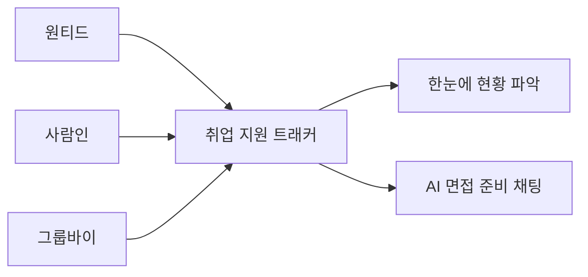
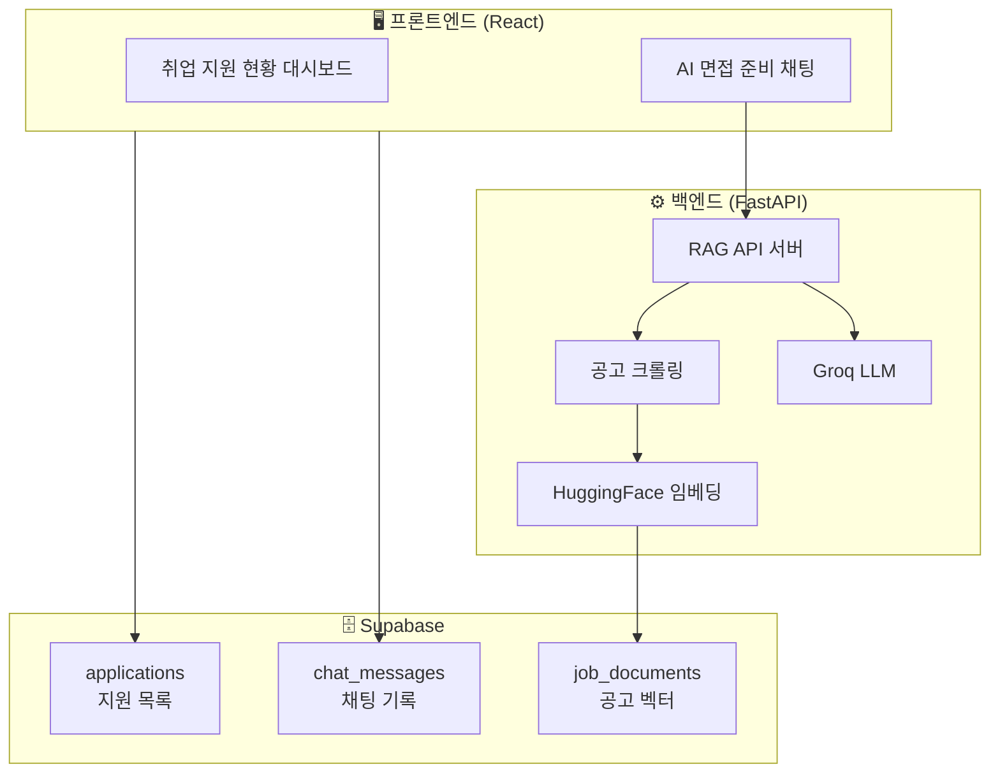
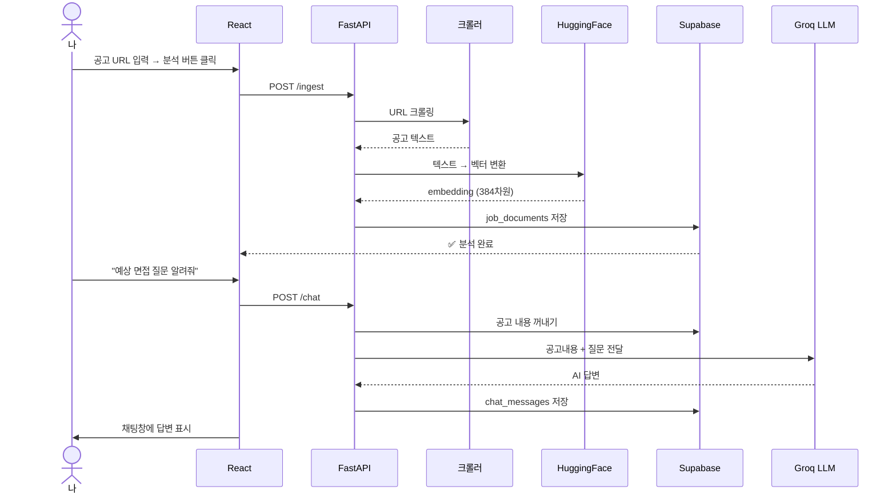
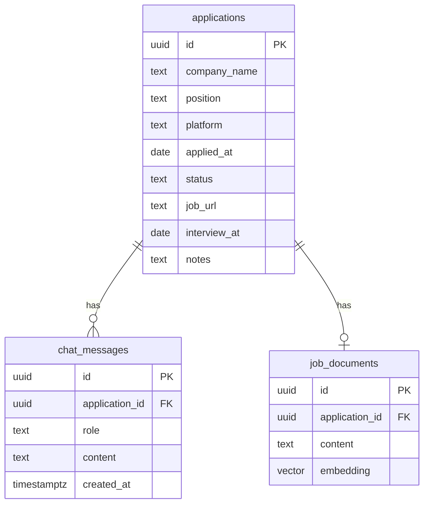
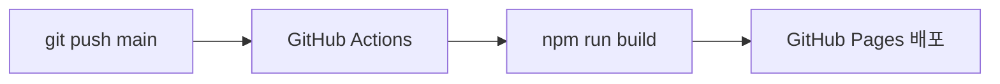

# 취준생이 직접 만든 취업 지원 트래커 — React + Supabase + RAG까지

---

## 만든 이유

원티드, 사람인, 그룹바이 다 쓰면서 지원한 곳이 50개가 넘어갔다.

근데 연락이 오면 이런 상황이 온다.

> "안녕하세요, OO팀 담당자입니다."

머릿속이 하얘진다.

> '이 회사가 어디지? 어떤 포지션이었지? 언제 넣었지?'

매번 세 개 사이트를 다 뒤져서 찾는다. 너무 비효율적이다.

그래서 그냥 만들었다. 어차피 쓸 거면 포트폴리오도 되는 걸로.

---

## 뭘 만들었냐



기능은 딱 필요한 것만 만들었다.

- 지원 목록 한눈에 보기 (회사명, 포지션, 플랫폼, 지원일, 상태)
- 상태 관리 — 서류중 / 서류합격 / 면접 / 최종합격 / 탈락
- 플랫폼별 탭 (원티드 / 사람인 / 그룹바이)
- 공고 URL 넣으면 **AI가 면접 준비 도와주는 채팅**
- 채팅 기록 저장 (껐다 켜도 대화 유지)

---

## 기술 스택

| 역할 | 기술 |
|------|------|
| 프론트엔드 | React 18 + TypeScript + Vite |
| DB | Supabase (PostgreSQL) |
| 백엔드 | FastAPI (Python) |
| AI 임베딩 | HuggingFace sentence-transformers |
| LLM | Groq API (llama-3.1-8b-instant) |
| 배포 | GitHub Pages + GitHub Actions |

전부 무료다. 돈 한 푼 안 들었다.

---

## 전체 구조



---

## RAG가 어떻게 동작하냐

RAG(Retrieval-Augmented Generation)를 처음 써봤다.

한 줄로 설명하면 이렇다.

> **AI한테 그냥 물어보는 게 아니라, 공고 내용을 먼저 주고 그걸 바탕으로 답하게 하는 것**



공고를 크롤링해서 벡터로 만들어 저장해두고, 질문이 들어오면 그 공고 내용을 컨텍스트로 LLM에 넘긴다. 그러면 AI가 공고 기반으로만 답한다.

---

## 만들면서 막혔던 것들

### 1. 저장이 안 됨 (Supabase RLS)

지원 추가 버튼을 눌렀는데 저장이 안 됐다. 에러도 안 떴다.

알고 보니 Supabase 기본 보안 정책(RLS)이 INSERT를 막고 있었다.

```sql
alter table applications disable row level security;
```

개인용 앱이라 RLS 끄는 게 맞는 선택이었다.

### 2. .env 파일에 예시 텍스트 그대로

환경변수 파일을 만들고 실제 키를 안 넣었다.

브라우저 콘솔에 이런 에러가 떴다.

```
Failed to load resource: your-project-id.supabase.co
```

`.env` 열어서 `your-project-id` 부분을 실제 Supabase URL로 바꾸고 서버 재시작하니까 해결됐다.

### 3. 포트 8000 이미 사용 중

백엔드 서버를 백그라운드로 돌려놓고 또 실행하려다가 이 에러를 만났다.

```
[Errno 48] Address already in use
```

```bash
lsof -ti:8000 | xargs kill -9
```

이걸로 점유 중인 프로세스 죽이고 다시 실행했다.

### 4. Groq 모델 지원 종료

```python
model="llama3-8b-8192"
# Error: model_decommissioned
```

Groq 문서 찾아보니까 `llama-3.1-8b-instant`로 바뀌어 있었다. 한 줄만 바꾸면 됐다.

### 5. 한글 입력 후 Enter 시 마지막 글자가 남음

"안녕" 치고 Enter 눌렀더니 입력창에 "녕"이 남아있었다.

한글은 자모를 조합하는 방식이라 Enter 이벤트가 조합 중에 중복으로 발생하는 문제다.

```tsx
// 이렇게 고쳤다
onKeyDown={e => {
  if (e.key === 'Enter' && !e.nativeEvent.isComposing) handleSend();
}}
```

`isComposing`으로 한글 조합 중인지 체크하면 해결된다.

---

## DB 구조



---

## 실제 화면

**지원 목록 — 플랫폼별 탭**

원티드 29개, 사람인 19개, 그룹바이 8개.
탭 클릭하면 해당 플랫폼만 필터된다.
상태 카드 클릭하면 해당 상태만 필터된다.

**AI 면접 준비 채팅**

공고 URL 넣고 분석 버튼 누르면 공고 내용이 저장된다.
그 다음부터 "예상 면접 질문 알려줘", "자격요건이 뭐야?" 물어보면 공고 기반으로 답해준다.
채팅 기록은 Supabase에 저장되니까 껐다 켜도 이전 대화가 유지된다.

---

## 배포



`main` 브랜치에 push하면 GitHub Actions가 자동으로 빌드하고 배포한다.

프론트엔드 배포 URL: https://jjjuni-0818.github.io/job-tracker/

백엔드(FastAPI)는 아직 로컬에서만 실행된다. Railway 배포는 다음 편에서.

---

## 느낀 점

처음엔 "그냥 스프레드시트 쓰면 되지 않나?" 싶었다.

근데 만들고 나니까 달랐다. 직접 쓰는 도구를 직접 만들면 기능 하나 추가하고 싶을 때 바로 추가할 수 있다. 내가 원하는 대로 바꿀 수 있다.

무엇보다 RAG를 처음으로 실제 서비스에 붙여봤다. 개념으로 알고 있던 것과 직접 구현하는 건 완전히 달랐다.

공고 URL 하나 넣었을 뿐인데 AI가 그 공고 기반으로 면접 질문을 뽑아주는 걸 보고 "이게 되네?" 했다.

취준하면서 만들고, 취준하면서 쓰고 있다.

---

## 깃허브

https://github.com/jjjuni-0818/job-tracker

다음 편: Railway로 백엔드 배포해서 어디서든 AI 채팅 되게 만들기
