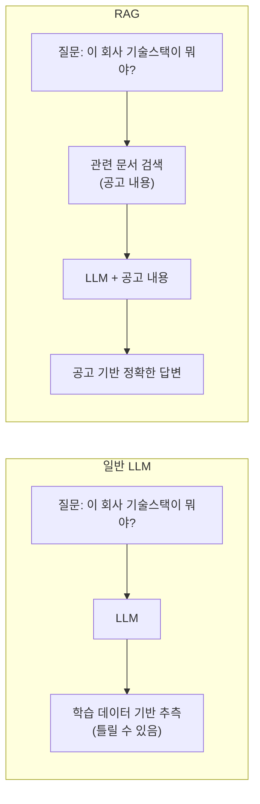
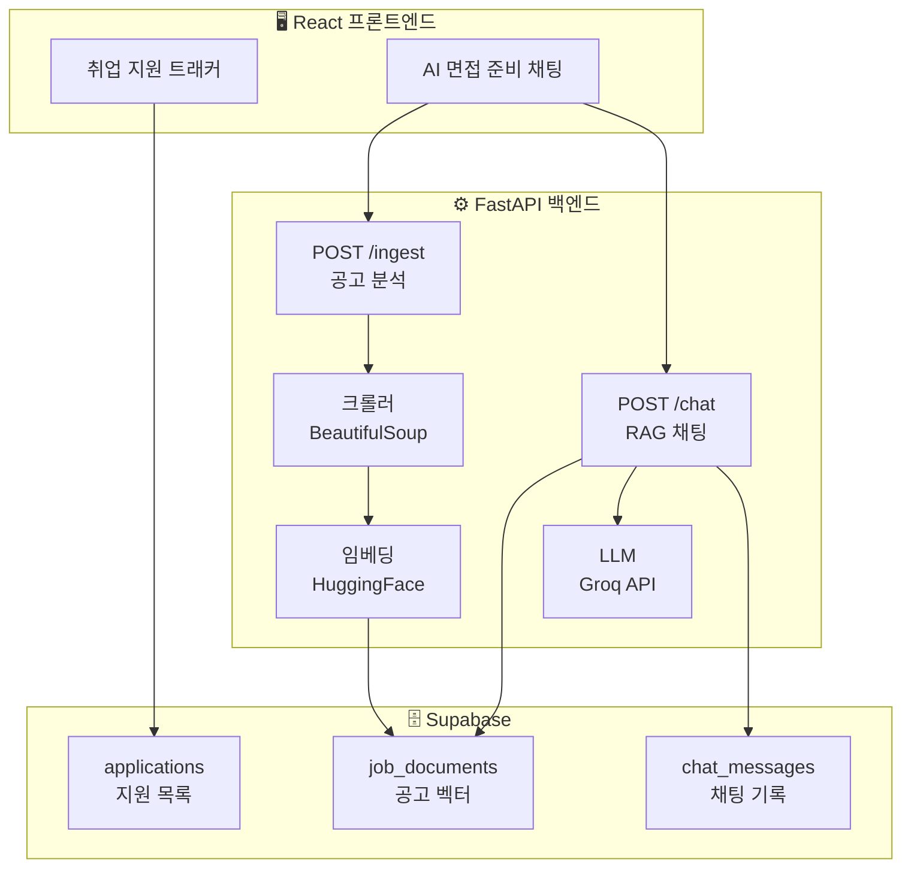
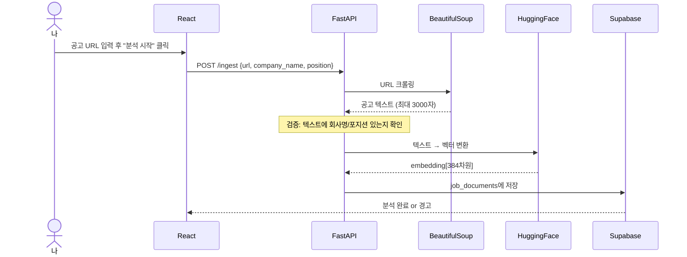
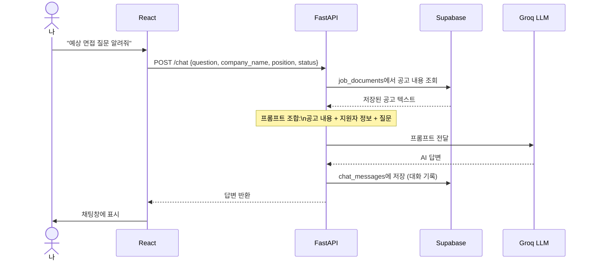
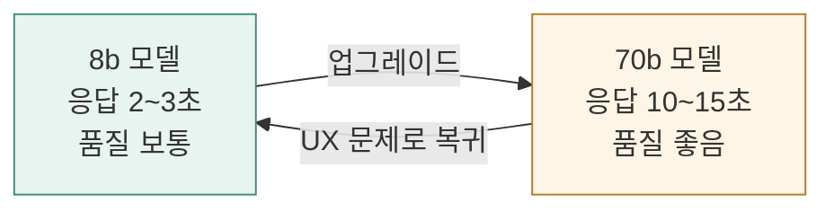
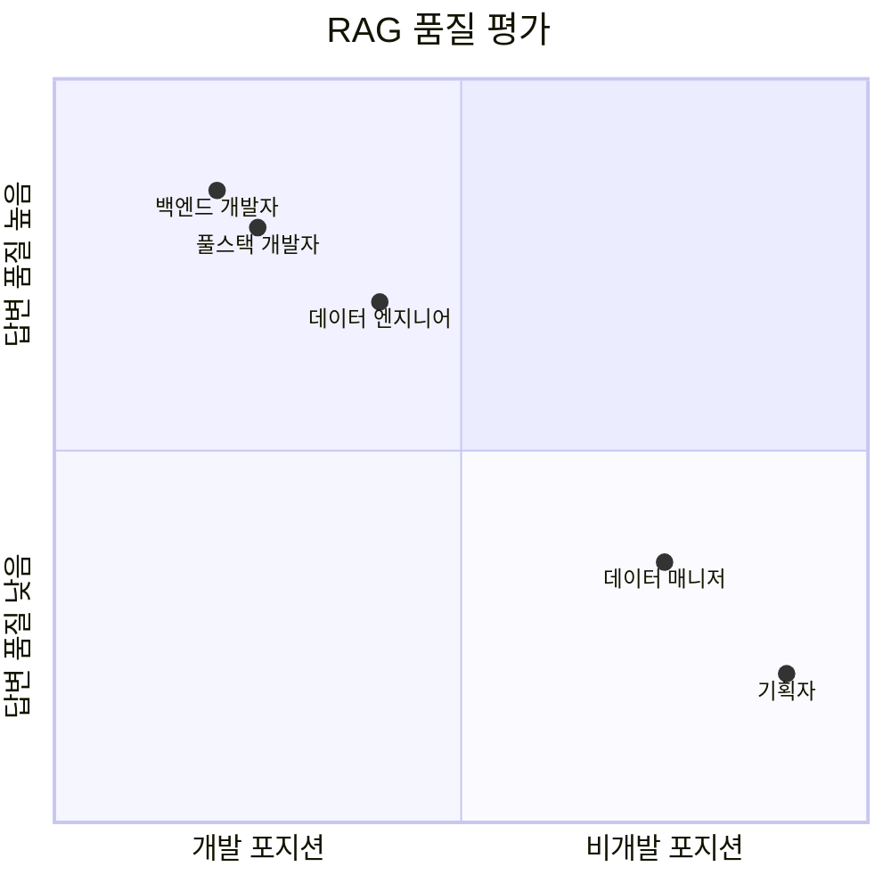
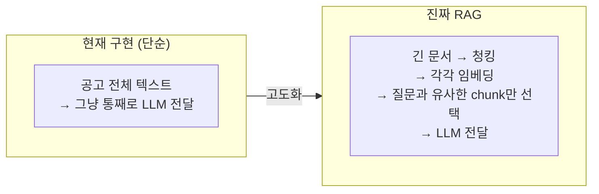

# 취준생이 RAG를 직접 구현해봤다 — FastAPI + HuggingFace + Groq

---

## 왜 RAG를 붙였냐

취업 지원 트래커를 만들고 나서 한 가지 불편함이 생겼다.

공고 URL을 넣어두긴 했는데, 면접 준비할 때마다 공고를 다시 읽어야 했다.

> "이 회사가 어떤 기술 쓰더라?"
> "자격요건이 뭐였지?"
> "내 스택으로 어떻게 어필하면 되지?"

매번 공고 열어서 읽고, 스스로 정리하는 게 귀찮았다.

그래서 붙였다. 공고 URL 넣으면 AI가 분석해서 면접 준비까지 도와주는 채팅.

---

## RAG가 뭐냐

RAG(Retrieval-Augmented Generation)를 한 줄로 설명하면:

> **AI한테 그냥 물어보는 게 아니라, 관련 문서를 먼저 찾아서 주고 그걸 바탕으로 답하게 하는 것**

일반 LLM vs RAG 차이:



---

## 전체 아키텍처



---

## 구현 흐름 상세

### 1단계: 공고 분석 (Ingest)



### 2단계: RAG 채팅 (Chat)



---

## 기술 선택 이유

| 역할 | 기술 | 이유 |
|------|------|------|
| 크롤링 | BeautifulSoup | 간단, 공고 페이지 텍스트 추출에 충분 |
| 임베딩 | HuggingFace sentence-transformers | **완전 무료**, 로컬 실행, 한국어 지원 |
| 벡터DB | Supabase pgvector | 기존 DB 그대로 확장, 추가 비용 없음 |
| LLM | Groq API (llama-3.1-8b) | **무료**, 빠름 (2~3초) |
| 백엔드 | FastAPI | 이미 써본 스택, 비동기 지원 |

**전부 무료다.** 서버비 0원으로 RAG 서비스를 만들 수 있다.

---

## 핵심 코드

### 임베딩 (embedder.py)

```python
from sentence_transformers import SentenceTransformer

# paraphrase-multilingual — 한국어 포함 다국어 지원 모델
# 최초 실행 시 자동 다운로드 (~120MB), 이후 캐시 사용
_model = SentenceTransformer("paraphrase-multilingual-MiniLM-L12-v2")

def get_embedding(text: str) -> list[float]:
    # normalize_embeddings=True → 벡터 크기를 1로 정규화
    # 코사인 유사도 계산 시 더 정확해짐
    embedding = _model.encode(text, normalize_embeddings=True)
    return embedding.tolist()  # Supabase에 저장하려면 list 타입이어야 함
```

**384차원이란?**
텍스트를 384개의 숫자로 표현한 것. 의미가 비슷한 텍스트는 비슷한 숫자 배열을 가짐.
예) "파이썬 개발자" ≈ "Python 엔지니어" → 비슷한 벡터

### LLM 호출 (llm.py)

```python
def ask_groq(context: str, question: str, company_name: str, position: str, status: str) -> str:
    prompt = f"""
[지원자 보유 기술 — 이 목록만 어필 가능]
✅ 보유: Python, FastAPI, React, TypeScript, Supabase, Pandas, Git
❌ 미보유: Node.js, Express, Java, Spring

[답변 규칙]
1. 어필 질문 → ✅ 목록에서만, "~할 수 있습니다" 형태
2. 공고에 없는 내용 → "공고에 해당 내용이 없습니다"
3. 자기소개 → 정주원 이름 사용, 실제 기술과 공고 연결

[채용 공고]
{context}

[질문]
{question}
"""
    response = client.chat.completions.create(
        model="llama-3.1-8b-instant",
        messages=[{"role": "user", "content": prompt}],
        temperature=0.2,  # 낮을수록 일관되고 정확한 답변
        max_tokens=1500,
    )
    return response.choices[0].message.content
```

---

## 만들면서 부딪힌 것들

### 1. Groq 모델 폐기 에러

```python
# 이렇게 쓰다가
model="llama3-8b-8192"

# 이 에러 맞음
# Error: model `llama3-8b-8192` has been decommissioned

# 현재 지원 모델로 교체
model="llama-3.1-8b-instant"
```

Groq는 주기적으로 구버전 모델을 폐기한다. [공식 deprecation 문서](https://console.groq.com/docs/deprecations) 확인하면 됨.

### 2. LLM이 없는 기술을 있다고 함 (할루시네이션)

공고에 "Node.js 경험 필요"라고 쓰여있으면, LLM이 지원자도 Node.js를 가지고 있다고 착각했다.

```
공고 텍스트: "Node.js / Express 기반 백엔드 API 개발 경험"
                              ↓
LLM 착각: "지원자는 Node.js를 사용한 경험이 있습니다" ← 틀림
```

**해결: 보유/미보유 체크리스트를 프롬프트에 명시**

```
✅ 보유: Python, FastAPI, React, TypeScript...
❌ 미보유: Node.js, Express, Java, Spring...
```

이렇게 명시하니까 공고에 Node.js가 있어도 지원자 기술로 언급하지 않게 됐다.

### 3. 70b 모델 vs 8b 모델

더 정확한 답변을 위해 70b 모델로 업그레이드해봤다.



10초 이상 기다리는 건 UX 관점에서 너무 길었다.
결론: **8b + 정밀한 프롬프트**가 속도/품질 균형에서 최선.

### 4. 채팅 기록 저장 안 되는 문제

채팅을 닫으면 대화가 사라졌다. Supabase RLS(Row Level Security)가 INSERT를 막고 있었다.

```sql
-- 해결: 개인용 앱이므로 RLS 비활성화
alter table chat_messages disable row level security;
alter table job_documents disable row level security;
```

---

## 현재 한계와 솔직한 평가



개발 포지션일수록 기술스택 연결이 자연스럽고, 비개발 포지션은 어색하다.

이건 RAG 구현 문제가 아니라 **지원자의 기술스택과 공고의 거리** 문제다.

---

## 지금 RAG 구현의 한계 (솔직하게)

지금 구현은 RAG의 입문 단계다.



공고 하나가 짧아서 지금은 통째로 넘겨도 됐다.
문서가 길어지면 청킹, 리랭킹, 하이브리드 검색이 필요하다.

---

## 느낀 점

RAG를 개념으로만 알고 있다가 직접 파이프라인을 짜보니 완전히 달랐다.

"공고 URL 하나 넣었을 뿐인데 AI가 면접 질문을 뽑아준다" — 이게 실제로 동작하는 걸 보고 신기했다.

아직 완성된 RAG는 아니다. 청킹도 없고, 유사도 검색도 제대로 안 한다.
근데 일단 돌아간다. 그리고 쓸 수 있다.

다음 단계는 청킹 전략과 하이브리드 검색을 붙여서 더 정확하게 만드는 것.

---

## 전체 스택 요약

```
공고 URL
    ↓
BeautifulSoup 크롤링 (텍스트 추출)
    ↓
HuggingFace sentence-transformers (벡터 변환, 무료)
    ↓
Supabase pgvector (벡터 저장)
    ↓
[질문 입력]
    ↓
Supabase에서 공고 내용 조회
    ↓
Groq API llama-3.1-8b (무료, 빠름)
    ↓
답변 생성 → Supabase chat_messages 저장
```

**깃허브**: https://github.com/jjjuni-0818/job-tracker

다음 편: Railway로 백엔드 배포해서 어디서든 AI 채팅 되게 만들기
